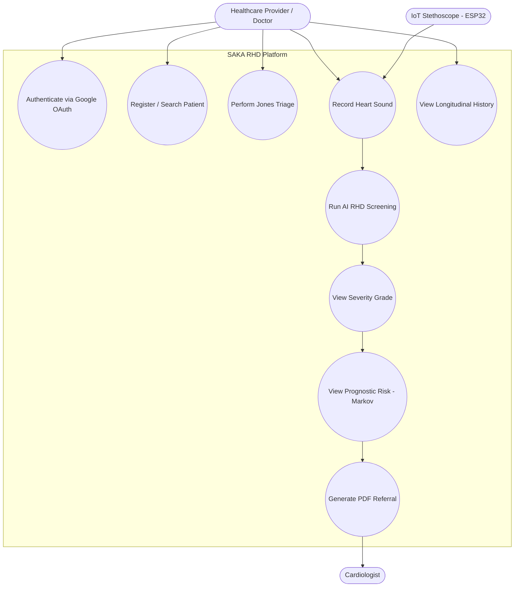
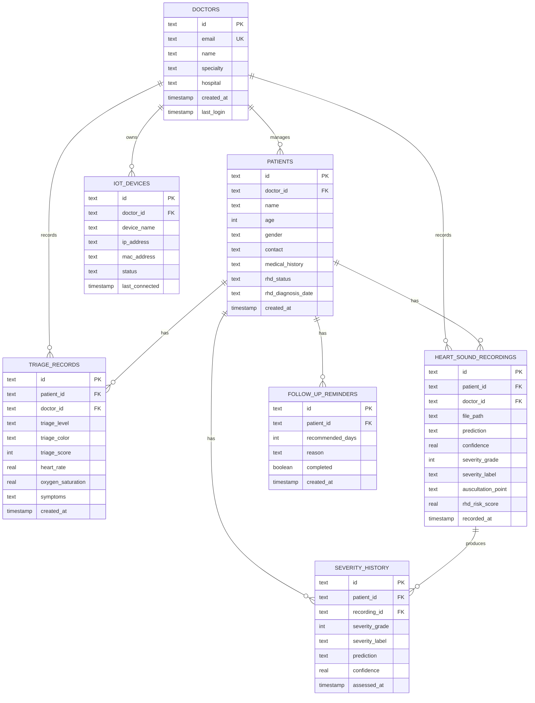
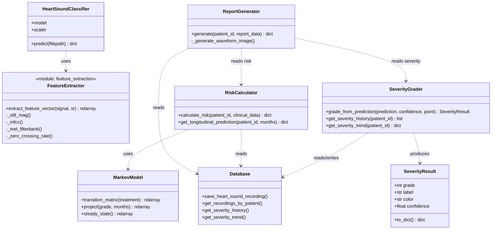
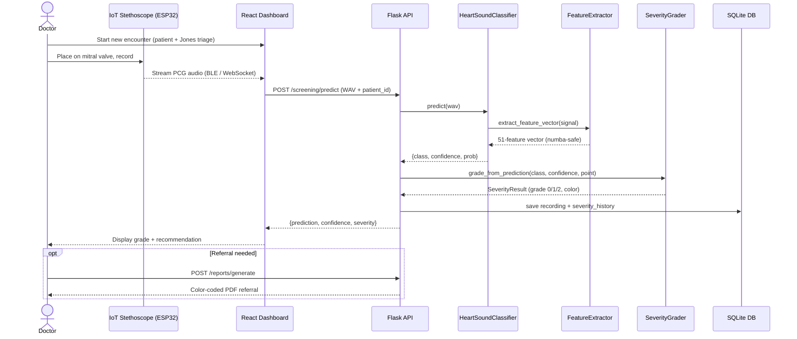

# SAKA RHD System — UML Suite

Standardized UML diagrams for the SAKA (HeartSound AI) RHD screening platform.
All diagrams are derived directly from the implemented codebase (Flask backend,
SQLite schema in `backend/services/database.py`, and the React dashboard) and
render natively on GitHub via Mermaid.

> For high-resolution raster/vector exports, paste any block into
> [mermaid.live](https://mermaid.live) and export PNG/SVG.

---

## 1. Use Case Diagram

---

## 2. Entity-Relationship Diagram (ERD)

Reflects the exact SQLite schema created in `backend/services/database.py`.

---

## 3. Class Diagram (Backend Services)

Reflects the implemented service layer in `backend/services/` and
`backend/api/v1/screening/`.

---

## 4. Sequence Diagram — Screening Encounter

The end-to-end flow implemented across the IoT firmware, React dashboard, Flask
API (`/api/v1/screening/predict`), and the service layer.

